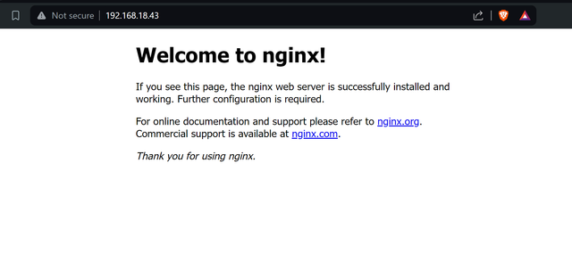

## Langkah 1: Persiapan Server
1. **Setup server**: Gunakan penyedia layanan cloud (seperti AWS, DigitalOcean, atau lainnya) atau siapkan server fisik.
2. **Instalasi Sistem Operasi**: Pasang distribusi Linux seperti Ubuntu Server.
3. **Setting Network:** Setting Network dari Nat ke Bridger Adapter jika menggunakan virtual Box

## Langkah 2: Konfigurasi SSH
1. **Instalasi OpenSSH Server:**
   
   ```bash
   sudo apt update
   sudo apt-get install openssh-server
   ```

2. **Konfigurasi SSH untuk menggunakan port 9005:**
   
   ```bash
   sudo nano /etc/ssh/sshd_config
   ```

- lalu ubah port delfault 22 menjadi 9005 dan hapus tanda pagarnya:
  
   ```
   Port 9005
   ```
   
3. **Restart layanan SSH:**
   ```bash
   sudo systemctl restart ssh
   ```

4. **Cek Ping dan Ping server:**
   
- Cek ip (pilih salah satu)
   ```bash
   ifconfig
   hostname I 
   ip a
   ```

- Uji ping
   ```bash
   ping ipadress_server
   ```
   
5. **Coba Masuk ke Server:**
   
   ```shell
   ssh -p 9005 userr@ipadressserver_or_hostname
   ```

- Untuk cek status server:
   ```bash
   sudo service ssh status
   ```

- Jika 'failed' maka aktifkan server dengan perintah berikut:
   ```bash
   sudo service ssh start
   ```

6. **Buat ssh public key di lokal komputer**
   
   ```shell
   ssh-keygen -t rsa -b 4096
   ```
   
- Masuk ke directory ssh dan liat menggunakan ls
  
   ```shell
   cd .ssh
   ```

7. **Copy public key ke ssh server buka menggunakan cat dan copy:**

- Buka public key di lokal komputer dan copy
   ```shell
   cat ~/.ssh/id_rsa.pub
   ```

- Masuk ke ssh server
   ```shell
   ssh -p 9005 user@ipadress
   ```
   
1. **Buat direktori ~/.ssh dan copy ke     authorized keys:**
   
   ```bash
   mkdir -p ~/.ssh
   nano ~/.ssh/authorized_keys
   ```

2.   **Masuk lagi ke konfig dan ubah passwordAuthentication:**
    
- Masuk ke konfig
   ```bash
   sudo nano /etc/ssh/sshd_config
   ```

- Hapus pagar dan ubah ke passwordAuthentication yes ke no
   ```
   pubkeyAuthentication yes
   passwordAuthentication no
   ```

11.  **Coba masuk lagi:**

- Masuk ke server menggunakan ssh atau remote os
   ```bash
   ssh -p 9005 user@ipadress_or_hostname
   ```


## Langkah 3: Membuat User Baru (guest) dan Hanya Bisa Akses ke Home Directory

1. **Membuat user baru:**
   
   ```bash
   sudo adduser guest
   ```
2. **Cek user**
   ```bash
   cat etc/passwd
   ```

3. **Buat file 'guest', setting kepemilikan ke guest, dan lakukan ACL (*Access Control List*) pada user guest:**
   
   ```bash
   sudo mkdir /home/guest
   sudo chown guest:guest /home/guest
   sudo chmod 750 /home/guest
   ```
  **ACL (Access Control List)**
   formatnya d(---)(---)(---)
   |Owner|Group|Other|
   |-----|-----|-----|
   |rwx|rwx|rwx|
   |4+2+1|4+2+1|4+2+1|
   
   4 = read
   2 = write
   1 = excecution
   contoh : sudo chmod 745
   berarti d(rwx)(r--)(r-x)


   - Cek perizinan di
   ```bash
   ll
   ```
   - atau 
   ```bash
   ls -ld 
   ```

4. **Edit konfigurasi ssh:**
   
- Masuk ke sshd_config
   ```bash
   sudo /etc/ssh/sshd_config
   ```

6. **Restart ssh:**
   
   ```bash
   sudo systemctl restart ssh
   ```

7. **Verifikasi status ssh:**
   
   ```bash
   sudo systemctl status ssh
   ```

3. **Tes akses direktori home dan guest:**
   
   ```bash
   cd /home/guest
   nano test.txt
   ls
   ```
4.  **Tes akses diluar direktori home:**
   misal kita test ke folder
   ```bash
   cd /media
   nano
   ```
   jika tulisan *unwritable* maka perizinan telah berhasil

## Langkah 4: Setup Web Server dengan HTTPS (pilih salah satu web server)

### WEB SERVER NGINX
**Instalasi Webserver**

1. **Install Webserver**
   
   ```bash
   sudo apt install nginx
   ```
2. **Start nginx**
   
   ```bash
   sudo systemctl start nginx
   ```
3. **Check nginx**
   
   ```bash
   sudo systemctl status nginx
   ```
4. **Seharusnya terdapat status active (running)**
   
   Dan jika diakses alamat ip nya akan ada website yang muncul
   


**Instalasi PHP**

5. **Install PHP FPM 8.1**
   
   ```bash
    sudo apt install php8.1-fpm
   ```
7. **Check PHP Status**
   
   ```bash
    sudo systemctl status php8.1-fpm
   ```
   


**Setup PHP pada nginx**

7. **Buka config nginx**
   
   ```bash
   sudo nano /etc/nginx/sites-available/default
   ```
   
- Edit config menjadi seperti berikut

   - Add index.php to the index list.
   - Uncomment the PHP scripts to FastCGI entry block.
   - Uncomment the line to include snippets/fastcgi-php.conf.
   - Uncomment the line to enable the fastcgi_pass and the php8.1-fpm. sock.
   - Uncomment the section to deny all access to Apache .htaccess files.
   

8. **Restart nginx**
   
   ```bash
   sudo systemctl restart nginx
   ```
   
10. **Test PHP**

   - Buat file PHP baru
     
   ```bash
   sudo nano /var/www/html/info.php
   ```
     
   - Pastekan script berikut
     
   ```bash
   <?php phpinfo(); ?>
   ```

   - Buka pada web browser <IP ADDRESS>/info.php

   - Seharusnya akan tampil informasi PHP yang berjalan
   

**Setup Web Demo**

10. **Cara 1: Mendapatkan index.php ke html menggunakan git**
   ```bash
   sudo apt install git
   ```
   - Clone repository
   ```bash
    git clone https://github.com/Rizqirazkafi/testing-website.git
   ```
   - Pindahkan index.php ke folder /var/www/html/

   - sudo mv testing-website/index.php /var/www/html/

Seharusnya, ketika alamat IP dibuka pada web browser akan sudah tertampil website demonya

- **Cara 2**
  
   ```bash
   cd /var/www/html
   ```
  - masuk ke https://github.com/Rizqirazkafi/testing-website dan copy isi src code index.php
  - pastekan disini
    
   ```bash
   sudo nano index.php
   ```

**Setup SSL**

11. **Install mkcert**
    
   ```bash
   sudo apt install mkcert
   ```

12.** Buat certificate untuk localhost**

   ```bash
   mkcert localhost
   ```

13. **Pindahkan certificate dan key**
   ```bash
   sudo mv localhost.pem /etc/ssl/certs
   sudo mv localhost-key.pem /etc/ssl/private
   ```

14. **Konfigurasi nginx**

   - Buka file konfigurasi nginx
     
      ```bash
      sudo nano /etc/nginx/sites-available/default
      ```
      
   - Tambahkan config berikut
     
      ```
      listen 443 ssl default_server;
      listen [::]:443 ssl default_server;
      ssl_certificate /etc/ssl/certs/localhost.pem;
      ssl_certificate_key /etc/ssl/private/localhost-key.pem;
      ```
      
   

15. **Restart nginx**
    
   ```bash
   sudo systemctl restart nginx
   ```

16. **Buka alamat IP pada web browser dengan menambahkan https**
   - ex: https://<IP ADDRESS>

   - Jika terdapat pesan warning, pilih advance kemudian pilih proceed to

   - Kita menggunakan self-signed SSL, sehingga akan tampil warning tersebut

   

17.** Web sudah berjalan pada protokol https**
   

### WEB SERVER APACHE2

1. **install apache2:**
   
   ```bash
   sudo apt install apache2
   sudo systemctl status apache2
   ```
   
19. **Masuk ke dir index.html:**
   
   ```bash
   cd /var/www/html/
   ls
   ```

20. **Test website html dengan local host:**
   
   ```bash
   firefox index.html
   ```
   https://index.html (ubah menjadi) 127.0.0.1/index.html

21. **Ambil (copy) Website php:**
   
   github.com/Rizkirazkafi/testing-website

- Edit file php dan tambahkan (paste)
  
  ```bash
  sudo gedit index.php
  ```

5. **Test website php dengan local host:**
   
   ```bash
   firefox index.php
   ```
   https://index.php (ubah menjadi) 127.0.0.1/index.php

6. **Instal nmap (opsional):**
   ```bash
   sudo apt-get update
   sudo apt-get install nmap
   ```

7. **Cek port (opsional):**
   
   ```bash
   nmap localhost
   ```

8. **Port web server tidak boleh sama dengan port ssh jadi biarkan saja port 80:**
    
   ```bash
   cd etc/apache2
   sudo nano ports.conf
   listen 80
   sudo service apache2 restart
   ```

9.  **Cek lagi menggunakan ipadrees server**
    
   ```bash
   cd /var/www/html
   ls
   firefox index.html
   ```

   https://index.html (ubah menjadi) ipadress/index.

   ```bash
   firefox index.php
   ```

   https://index.php (ubah menjadi) ipadress/index.php
   
## Langkah 5: Setup Storage Utama dan Backup Storage Server

note: jika menggunakan virtual box tambahkan disk di setting tambahkan 2 disk berukuran 10gb

1. **Cek disk yang tersedia:**
   ```bash
   lsblk
   lsblk -f
   ```

2. **Membuat Tabel partisi:**
   ```bash
   sudo cfdisk /dev/sdb
   sudo cfdisk /dev/sdc
   ```

- pilih gpt
- pilih new dan klik enter
- pilih opsi write dan klik enter
- jika selesai pilih opsi quit lau enter
  
3. **Memformat dengan ext4 dan melabelkan disk dengan 'main' dan 'backup':**
   
   ```bash
   sudo mkfs.ext4 -L main /dev/sdb1
   sudo mkfs.ext4 -L backup /dev/sdc1
   ```

4. **Buat Direktori Mount Point :**
   
   ```bash
   sudo mkdir -p /var/www/html
   sudo mkdir -p /mnt/backup
   ```

5. **Pasang Direktori dan Mount disk secara manual untuk memeriksa:**
   
   ```bash
   sudo mount /dev/sdb1 /var/www/html
   sudo mount /dev/sdc1 /mnt/backup
   ```

6. **Tambahkan disk ke fstab untuk mount otomatis saat boot:**
   
   ```bash
   sudo nano /etc/fstab
   ```
   - Tambahkan dan gunakan jarak spasi menggunakan **tab**
   ```
   /dev/sdb1  /var/www/html  ext4  defaults  0  2
   /dev/sdc1  /mnt/backup  ext4  defaults  0  2
   ```
7. **Verifikasi mount:**
   
   ```bash
   df -h 
   ```

8. **Buatlah Automatisasi Backup dengan cara:**
   
- Buat script Backup
   ```bash
   sudo nano /usr/local/bin/backup.sh
   ```

- Tambahkan baris berikut
   ```
   #!/bin/bash
   rsync -av --delete /var/www/html/ /mnt/backup/ &>> /var/log/backup.sh
   ```
   
- Simpan dan tutup file, lalu buat skrip dapat dieksekusi: 
   ```bash
   sudo chmod +x /usr/local/bin/backup.sh
   ```

- Menjalankan Script Secara Manual  : 
  ```bash
  sudo /usr/local/bin/backup.sh
  ```

- Memeriksa Log Backup:
  ```bash
  sudo cat /var/log/backup.sh
  ```

- Menjalankan Script Backup dengan automatis menggunakan Cron job (opsional)
  ```bash
  sudo crontab -e
  ```

- contoh:  baris berikut untuk menjalankan backup setiap hari pada jam 2 pagi: (opsional)
  ```bash
  0 2 * * * /usr/local/bin/backup.sh
  ```

- Cek dan verifikasi data  di dr backup
  ```bash
  ls /mnt/backup
  ```

9. **Jika gagal gunakan perintah ini untuk menghapus partisi:**
    
-  Sebelum itu unmount terlebih  dahulu

   ```bash
   sudo umount /dev/sdb <direktori mount>
   sudo umount /dev/sdc <direktori mount>
   ```
   
   ```bash
   sudo fdisk /dev/sdb
   sudo fdisk /dev/sdc
   ```

- tekan 'd' lalu enter untuk menghapus partisi
- tekan 'w' lalu enter untuk write dan keluar


   
